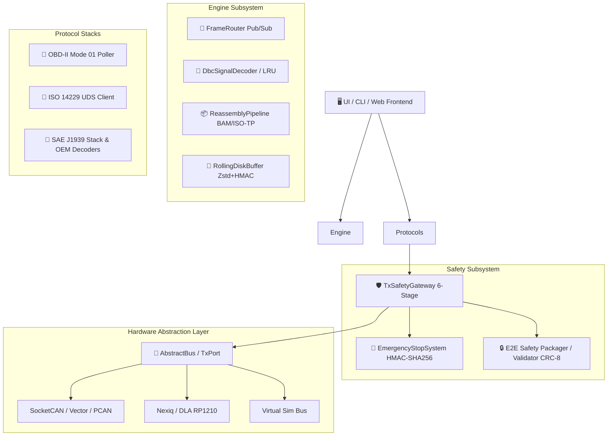

# 🚗 Universal CAN-Bus Tool — Knowledge Base & AI Hub

> **CAN Diagnostic & Telemetry Framework (ISO 26262 ASIL-B/D Design Principles)**
> Python 3.11+ · Hexagonal Architecture · 1160+ Tests Passed · 0 Ruff Errors

---

## ⚡ Hızlı Erişim & AI Bağlam Kartları (AI Context Library)

Bu notlar, AI asistanlarıyla (Antigravity, Cursor, Claude Code, Copilot, Logseq AI) çalışırken hızlıca referans vermeniz (`@` veya `[[...]]`) için optimize edilmiştir:

- 🏛️ [[01_ARCHITECTURE_AND_LAYERS|01. Mimari & Hexagonal Katmanlar]] (`docs/ai_context/01_ARCHITECTURE_AND_LAYERS.md`)
- 🛡️ [[02_FUNCTIONAL_SAFETY_INVARIANTS|02. Fonksiyonel Güvenlik & E-Stop]] (`docs/ai_context/02_FUNCTIONAL_SAFETY_INVARIANTS.md`)
- 📡 [[03_PROTOCOLS_AND_TRANSPORTS|03. Protokoller & Taşıma Yığınları (J1939, UDS, OBD-II)]] (`docs/ai_context/03_PROTOCOLS_AND_TRANSPORTS.md`)
- 🚛 [[04_OEM_DIAGNOSTICS_MATRIX|04. OEM Diagnostik & Dekoder Haritası (Cummins, Scania, Volvo...)]] (`docs/ai_context/04_OEM_DIAGNOSTICS_MATRIX.md`)
- 🧪 [[05_TESTING_AND_VERIFICATION|05. Test Standartları & Doğrulama]] (`docs/ai_context/05_TESTING_AND_VERIFICATION.md`)
- 🎯 [[PROMPT_RECIPES|Hazır AI Prompt Tarifleri & Copilot Playbooks]] (`docs/ai_context/PROMPT_RECIPES.md`)

---

## 📋 Görev & İlerleme Panosu

- 📋 [[TASK_BOARD|Proje Görev & Kilometre Taşı Panosu]] (`docs/TASK_BOARD.md`)
- 🗺️ [[ROADMAP|Kalan İşler ve Yol Haritası (Roadmap)]] (`docs/ROADMAP.md`)

---

## 📖 Protokol & Standart Referans Kılavuzları

- 🔧 [[uds_services_and_nrc_reference|ISO 14229 UDS Servisleri & Negatif Yanıt Kodları (NRC)]]
- 🚛 [[j1939_dm_dtc_reference|SAE J1939 Diagnostik Mesajları (DM1..DM11) & DTC Formatı]]

---

## 📚 Proje Spesifikasyonları & Dokümantasyon

- 🗺️ [[MASTER_PLAN|Master Mimari Planı (Architecture Master Plan)]] (`docs/architecture/MASTER_PLAN.md`)
- 🔍 [[traceability|Test & Gereksinim İzlenebilirlik Matrisi (Traceability Matrix)]] (`docs/testing/traceability.md`)
- 📄 [[j1939_diagnostics_spec|SAE J1939 Diagnostik Spesifikasyonu]] (`docs/specs/j1939_diagnostics_spec.md`)
- 🛡️ [[transport_e2e_safety_spec|Taşıma & E2E Güvenlik Spesifikasyonu]] (`docs/specs/transport_e2e_safety_spec.md`)
- ⚠️ [[Saha_Risk_Katalogu_Guvenlik_Gereksinimleri_ve_Risk_Azaltma_Plani_FINAL_v1.2|Saha Risk Kataloğu & Güvenlik Gereksinimleri]] (`docs/audit/`)
- 🤖 [[OFFLINE_COPILOT_RESEARCH|Offline Copilot & LLM Araştırması]] (`docs/research/`)

---

## 🏗️ Mimari Şeması (Hexagonal Layers)

---

## 💡 AI Araçları ile Birlikte Çalışma İpuçları

1. **AI Ajanına (Antigravity/Cursor/Claude) Görev Verirken:**
   - *"[[01_ARCHITECTURE_AND_LAYERS]] ve [[02_FUNCTIONAL_SAFETY_INVARIANTS]] kurallarına uyarak yeni bir NMEA2000 dekoderi yaz."* şeklinde doğrudan kart adını verebilirsiniz.
2. **Logseq İçinde AI Eklentisi Kullanırken:**
   - Logseq'in GPT/Ollama eklentileri veya Copilot ile dokümanlar arasında anında semantik arama yapabilirsiniz.
3. **Yeni Mimari Karar Eklerken:**
   - `docs/adrs/` altına `docs/templates/template_adr.md` şablonunu kullanarak yeni bir ADR dosyası ekleyin; bağlantılar otomatik oluşacaktır.
