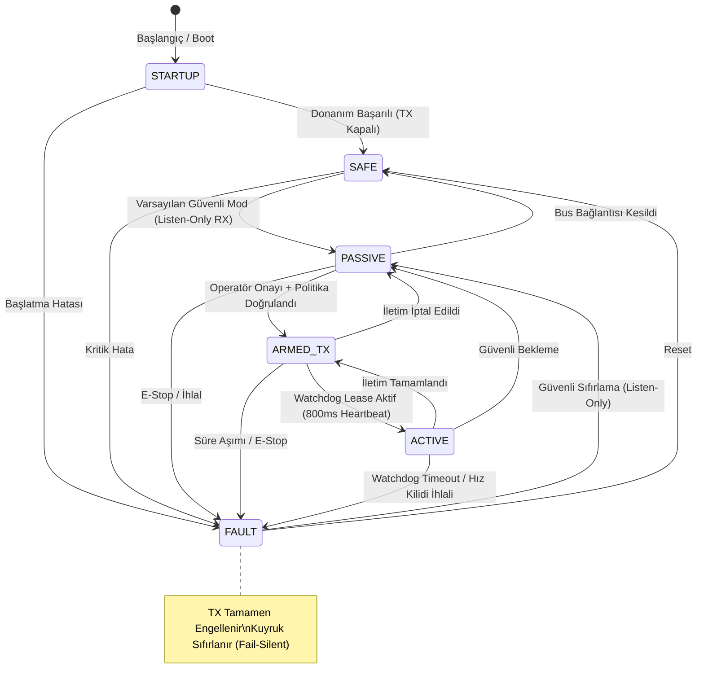
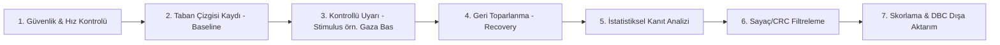

# 🚀 Universal CAN-Bus Diagnostic & Telemetry Platform (v13.0)

[](https://github.com/si6n/Universal-CAN-BUS-Tool/actions/workflows/ci.yml)
[](https://github.com/si6n/Universal-CAN-BUS-Tool/actions)
[](https://www.python.org/)
[](LICENSE)
[](https://github.com/astral-sh/ruff)
[](https://github.com/si6n/Universal-CAN-BUS-Tool)

> **Endüstriyel Otomotiv, Ağır Vasıta, İş Makinesi & Marin Telemetri, Teşhis ve Yapay Zeka Destekli Copilot Platformu**  
> *ISO 11898-1:2015/2024 (CAN / CAN-FD) • SAE J1939-21/71/73/81 • ISO 14229-1 UDS • ISO 15765-2 DoCAN • NMEA 2000 (ISO 11783-3) • TMC RP1210 (A/B/C) • Volvo Penta EDC/EVC*

---

## 🛡️ Güvenlik & Standart Uyumluluk Rozetleri

| Standart / Güvenlik Katmanı | Durum / Uyumluluk | Test Kapsamı | Güvenlik Seviyesi |
| :--- | :---: | :---: | :---: |
| **Saha Risk Kataloğu v1.2** | 🟢 Uyumlu | 42/42 Madde Kapatıldı | **Fail-Silent & Safe-by-Default** |
| **CAN / CAN-FD (ISO 11898-1)** | 🟢 Uyumlu | Doğrulanmış kapsam: CI artefaktı | 64-Bayt FD / BRS / ESI / CRC-17/21 |
| **SAE J1939 (21, 71, 73, 81)** | 🟢 Doğrulanmış Conformance | BAM, RTS/CTS, 64-bit NAME | DM1..DM11, SPN/FMI/OC/Lamp, Sentinel |
| **ISO-TP & UDS (15765-2 / 14229-1)** | 🟢 Doğrulanmış Conformance | Single/Multi-Frame, Seed-Key | 0x10, 0x11, 0x22, 0x27, 0x2E, 0x31, 0x34..0x37 |
| **NMEA 2000 & Volvo Penta EVC** | 🟢 Doğrulanmış Conformance | Fast Packet (223B), PGN 65360/65361 | Motor, Şanzıman, Trim (-100%..+100%), Dümen |
| **TMC RP1210 (A/B/C)** | 🟢 Aktif (Yazılım Kapsamı) | RP1210Bus adaptörü + mock-DLL yaşam döngüsü testleri | Çoklu Donanım HAL & Hata Yönetimi *(yazma yolu TxSafetyGateway üzerinden; canlı donanım saha doğrulaması beklenir)* |
| **Lisanslama & Anti-Tamper** | 🟡 Altyapı Hazır, Entegrasyon Planlı | DPAPI + CIM HWID + 7-Day Grace *(kütüphane doğrulandı; ürün akışına bağlanacak)* | Anti-Clock Rollback + Win32 Anti-Debug |
| **Kod Kalitesi & Statik Analiz** | 🟢 Ruff Linting Temiz | 0 Hata / 0 Uyarı | Python 3.13 Strict Type Hints |

---

## 📸 Arayüz & Kokpit Mimarisi

Platform; **React 18 + TypeScript + Tailwind CSS + Native Windows Desktop (Microsoft Edge WebView2)** mimarisiyle geliştirilmiş olup, 60 FPS donanım hızlandırmalı gerçek zamanlı veri akışına ve modern mühendislik estetiğine sahiptir.

```
┌──────────────────────────────────────────────────────────────────────────────────────────────────┐
│                                 UNIVERSAL CAN-BUS DIAGNOSTIC v13.0                               │
│  [● vcan0 Bağlı (250 kbps)]     [Yük: %24]   [Paket: 15,523]   [Hata: 0]      [🔴 E-STOP] [⚙️]    │
├──────────────────────────────────────────────────────────────────────────────────────────────────┤
│  [Canlı Kokpit]   [ECU Flashing & Bootloader]   [Konnektör Pinout]   [Rapor & Dışa Aktarma]      │
├─────────────────────────────────────────────────────────────┬────────────────────────────────────┤
│  CAN SNIFFER TABLOSU (Gerçek Zamanlı 60 FPS)                 │  AI DIAGNOSTIC COPILOT (Hibrit)    │
│  ┌──────────┬──────┬─────┬───┬────────────────────────────┐  │  ┌──────────────────────────────┐  │
│  │ Zaman    │ ID   │ DLC │Dir│ Data (Hex)                 │  │  │ ⚠️ DTC P0300 TESPİT EDİLDİ   │  │
│  ├──────────┼──────┼─────┼───┼────────────────────────────┤  │  │ Rastgele/Çoklu Ateşleme Hata  │  │
│  │ 12.43102 │0x18F4│  8  │Rx │ 00 1A 2F FF 00 12 A0 04    │  │  ├──────────────────────────────┤  │
│  │ 12.43215 │0x0CF0│  8  │Rx │ 64 7D 00 1F 00 FF FF FF    │  │  │ Kök Neden Olasılıkları:       │  │
│  └──────────┴──────┴─────┴───┴────────────────────────────┘  │  │ • Buji/Bobin Ateşleme Kaçağı  │  │
│  ─────────────────────────────────────────────────────────  │  │ • Enjektör Basınç Düşüşü     │  │
│  SİNYAL OSİLOSKOPU (CAN Signal Waveform & FFT)              │  │ • UDS 0x31 Kompresyon Testi  │  │
│  ┌────────────────────────────────────────────────────────┐  │  ├──────────────────────────────┤  │
│  │ 2200 ───┐     /\             RPM Sinyali               │  │  │ 💬 Mühendislik Sohbeti &     │  │
│  │ 1800 ───┴────/  \────/\____  Turbo Boost: 1.42 Bar     │  │  │ Çözüm Adımları Rehberliği    │  │
│  └────────────────────────────────────────────────────────┘  │  └──────────────────────────────┘  │
└─────────────────────────────────────────────────────────────┴────────────────────────────────────┘
```

---

## 📑 İçindekiler
1. [🌟 Temel Yetenekler ve Öne Çıkan Özellikler](#-temel-yetenekler-ve-öne-çıkan-özellikler)
2. [🏛️ 6 Katmanlı Normatif Mimari](#️-6-katmanlı-normatif-mimari)
3. [🛡️ Endüstriyel Güvenlik Mimarisi (Saha Risk Kataloğu v1.2)](#-endüstriyel-güvenlik-mimarisi-saha-risk-kataloğu-v12)
   - [Formal Safety State Machine](#1-formal-safety-state-machine)
   - [800 ms Monotonic TX Watchdog Supervisor](#2-800-ms-monotonic-tx-watchdog-supervisor)
   - [Çift Onaylı TX Safety Gateway & Speed Interlock](#3-çift-onaylı-tx-safety-gateway--speed-interlock)
   - [Replay Trace Güvenlik Filtresi](#4-replay-trace-güvenlik-filtresi)
   - [DBC Sinyal Geçerlilik (Sentinel Range) Filtresi](#5-dbc-sinyal-geçerlilik-sentinel-range-filtresi)
4. [🔌 Desteklenen Protokoller ve İkili Ayrıştırıcılar](#-desteklenen-protokoller-ve-i̇kili-ayrıştırıcılar)
   - [CAN & CAN-FD (ISO 11898-1:2015/2024)](#1-can--can-fd-iso-11898-120152024)
   - [SAE J1939 (Ağır Vasıta, Otobüs & İş Makineleri)](#2-sae-j1939-ağır-vasıta-otobüs--i̇ş-makineleri)
   - [ISO 14229 UDS & ISO 15765-2 DoCAN (ECU Bootloader & Flashing)](#3-iso-14229-uds--iso-15765-2-docan-ecu-bootloader--flashing)
   - [NMEA 2000 (Marin Telemetri & Ağır Marin Motorları)](#4-nmea-2000-marin-telemetri--ağır-marin-motorları)
   - [Volvo Penta EDC / EVC (Marin Motor & Dümen Telemetrisi)](#5-volvo-penta-edc--evc-marin-motor--dümen-telemetrisi)
5. [🔬 Kanıt Tabanlı Sinyal Keşif & Tersine Mühendislik Motoru](#-kanıt-tabanlı-sinyal-keşif--tersine-mühendislik-motoru)
6. [🧮 Doğrulanmış Matematiksel Sanal Kanallar (Virtual Channels)](#-doğrulanmış-matematiksel-sanal-kanallar-virtual-channels)
7. [⚡ Bellek, Tamponlama ve Kara Kutu Mimarisi](#-bellek-tamponlama-ve-kara-kutu-mimarisi)
8. [🔐 Lisanslama, Kriptografi ve Cihaz Güvenliği (DRM & DPAPI)](#-lisanslama-kriptografi-ve-cihaz-güvenliği-drm--dpapi)
9. [🚀 Hızlı Başlangıç: Kurulum ve Çalıştırma](#-hızlı-başlangıç-kurulum-ve-çalıştırma)
   - [Bağımsız `.EXE` Olarak Çalıştırma](#1-bağımsız-exe-olarak-çalıştırma)
   - [Geliştirici Modunda Python ile Başlatma](#2-geliştirici-modunda-python-ile-başlatma)
   - [Komut Satırı (CLI) Parametreleri](#3-komut-satırı-cli-parametreleri)
10. [📦 Tek Tıkla Bağımsız `.EXE` Derleme](#-tek-tıkla-bağımsız-exe-derleme)
11. [🎛️ Arayüz Modülleri & Yetenekleri](#-arayüz-modülleri--yetenekleri)
12. [🔌 Donanım Arayüzleri & Sürücüler (HAL)](#-donanım-arayüzleri--sürücüler-hal)
13. [🧪 Testler, Kalite Güvencesi ve Kapsam](#-testler-kalite-güvencesi-ve-kapsam)
14. [📁 Proje Dizin Mimarisi](#-proje-dizin-mimarisi)

---

## 🌟 Temel Yetenekler ve Öne Çıkan Özellikler

* **⚡ Sıfır Gecikmeli Telemetri & 60 FPS Grafik:** CAN/CAN-FD mesajlarını mikrosaniye zaman damgalarıyla yakalar, dinamik bayt renklendirmesiyle gösterir ve yüksek yenileme hızında osiloskop grafikleri çizer.
* **🤖 Hibrit AI Diagnostic Copilot:** Çevrimdışı yerel otomotiv teşhis motoru ve opsiyonel **Google Gemini 2.0 Flash LLM** entegrasyonuyla canlı DTC kök neden analizi, arıza olasılık dağılımı ve adım adım interaktif onarım rehberliği.
* **🛡️ E-Stop & TX Safety Gateway:** Donanım seviyesinde acil durdurma (E-Stop), araç hareket halindeyken tehlikeli mesajları bloke eden hız kilidi (*Speed Interlock*), sliding-window hız sınırlayıcı (100 msg/s) ve yetkisiz komutları engelleyen dinamik beyaz liste (*Whitelist*). E-Stop sonrası kurtarma, HMAC imzalı reset jetonu ile çalışır: **geçerli sürümde jeton aynı süreç tarafından üretilip tüketildiğinden bu bir yerel kurtarma akışıdır** — dağıtık/çoklu operatörlü yetkilendirme (bağımsız doğrulayıcı) planlanmektedir.
* **🧠 Çift Yönlü Tam Protokol Desteği:** J1939 (BAM, RTS/CTS, DM1..DM11, Dynamic Address Claiming, Sentinel bounds), ISO 14229 UDS (ECU Flashing, Seed-Key, RoutineControl, NRC analizi) ve NMEA 2000 Fast Packet desteği.
* **🔬 Kanıt Tabanlı Tersine Mühendislik (Signal Discovery):** Uyarı-Tepki (Stimulus-Response) deney protokolü, Pearson/Spearman korelasyonu, Time-Lag analizi, Sayaç/CRC eleme ve tek tıkla DBC dosyası üretimi.
* **🧮 Doğrulanmış Sanal Kanallar:** Motor Torku ($N\cdot m$), Güç ($kW$ / $HP$), Marin Yakıt Verimliliği ($L/NM$), Karayolu Yakıt Tüketimi ($L/100km$) ve Pervane Kayma Oranı (Propeller Slip %).
* **💾 Yüksek Hızlı MDF4, MAT, KML, ASC ve SHA-256 Raporlar:** Verileri ASAM MDF4 (`.mf4`), MATLAB (`.mat`), Google Earth (`.kml`), Vector CANoe (`.asc`), CSV/JSON ve kriptografik SHA-256 özetli tahrif edilemez HTML/PDF servis raporu olarak kaydeder.
* **📦 Tek Parça Taşınabilir Masaüstü Uygulaması:** Kurulum gerektirmeyen, Python + React 18 + WebView2 mimarisiyle bağımsız Windows çalıştırılabilir dosyası (`.exe`).

---

## 🏛️ 6 Katmanlı Normatif Mimari

Platform, endüstriyel otomotiv ve marin telemetri sistemleri için 6 katmanlı normatif mimari modele göre inşa edilmiştir:

```mermaid
graph TD
    subgraph Layer1 [1. SUNUM & ARAYÜZ KATMANI]
        UI[React 18 + Tailwind CSS + Lucide Icons + Edge WebView2]
        Dash[Canlı Kokpit & Osiloskop]
        FlashUI[ECU Flashing & Bootloader UI]
        PinoutUI[OBD-II & Deutsch 9-Pin Kılavuzu]
        ReportUI[Rapor & Dışa Aktarma Merkezi]
    end

    subgraph Layer2 [2. ALAN & ANLAMSAL MODEL KATMANI]
        Copilot[AI Diagnostic Copilot & Rule Engine]
        VirtChan[Virtual Channels Engine: Torque, HP, L/NM, Slip]
        SigDisc[Signal Discovery & Reverse Engineering Engine]
        DbcDec[DBC Signal Decoder & Sentinel Range Filter]
    end

    subgraph Layer3 [3. TEŞHİS SERVİSLERİ KATMANI]
        J1939Diag[J1939 DM1..DM11 & DTC Parsing]
        UDSServ[ISO 14229 UDS Services & Flasher Sequence]
        VolvoDiag[Volvo Penta EDC MID 128 & EVC PGN 65360/65361]
    end

    subgraph Layer4 [4. TAŞIMA KATMANI]
        J1939TP[J1939-21 Transport Protocol: BAM & RTS/CTS CMDT]
        ISOTP[ISO 15765-2 DoCAN: Classical & CAN-FD 64B Flow Control]
        N2KFP[NMEA 2000 Fast Packet Reassembly 223B]
    end

    subgraph Layer5 [5. CAN ÇEKİRDEĞİ & GÜVENLİK KATMANI]
        SafeSM[Formal Safety State Machine: Fail-Silent / Safe-by-Default]
        Watchdog[800ms Monotonic TX Watchdog Supervisor]
        Gateway[TX Safety Gateway: Speed Interlock & Whitelist]
        EStop[Emergency Stop Subsystem TOCTOU-Safe]
        RingBuf[NumPy 300K Frame Bounded Ring Buffer]
        DiskBuf[Rolling Zstandard Compressed Blackbox Disk Buffer]
    end

    subgraph Layer6 [6. DONANIM SOYUTLAMA KATMANI - HAL]
        VirtBus[Virtual CAN Simulator]
        PCAN[PEAK PCAN-Basic HAL]
        Kvaser[Kvaser CANlib HAL]
        RP1210[TMC RP1210 Client: Nexiq, Noregon, Cummins]
        Vector[Vector Informatik XL Driver]
        SocketCAN[Linux SocketCAN: can0, vcan0]
        Replay[ReplayBus: Vector ASC Player with Safety Filter]
    end

    Layer1 --> Layer2
    Layer2 --> Layer3
    Layer3 --> Layer4
    Layer4 --> Layer5
    Layer5 --> Layer6
```



---

## 🛡️ Endüstriyel Güvenlik Mimarisi (Saha Risk Kataloğu v1.2)

Platform, **Saha Risk Kataloğu ve Güvenlik Gereksinimleri Planı v1.2** doğrultusunda 42 maddelik güvenlik standardını donanım ve yazılım katmanında eksiksiz uygular:

### 1. Formal Safety State Machine



* **Safe-by-Default (Varsayılan Güvenli):** Sistem açılışta ve her arıza sonrasında doğrudan `PASSIVE` (Sadece Dinleme / Listen-Only) durumuna geçer; operatörün açık onayı olmadan hatta 1 bit dahi TX basılamaz.
* **Fail-Silent İlkesi:** Herhangi bir kural ihlali, geçersiz durum geçişi veya iletişim kopmasında sistem `FAULT` durumuna geçer ve tüm iletim izinlerini sıfırlar.

### 2. 800 ms Monotonic TX Watchdog Supervisor
* İletim yapan tüm arayüz ve UI bileşenleri 800 ms içinde bir kalp atışı (`heartbeat`) göndermek zorundadır. UI lease'i, arayüzün render döngüsünden (rAF pulse, 250 ms) beslenir; arayüz donarsa lease süresi dolar.
* Süre aşımında (`KEEPALIVE_TIMEOUT`) Watchdog devreye girer, acil durdurmayı (E-Stop) tetikler ve giden mesaj kuyruğunu anında temizler.

### 3. Çift Onaylı TX Safety Gateway & Speed Interlock
* **Hız Kilidi (Speed Interlock):** Araç hızı $>0.5\text{ km/h}$ olduğunda kalibrasyon, aktif test ve UDS flash komutları donanım seviyesinde engellenir.
* **Sliding-Window Hız Sınırlayıcı:** Veri yolunun kilitlenmesini engellemek için saniyede maksimum 100 mesaj sınırı (`MAX_TX_RATE_PER_SEC = 100`) uygulanır.
* **Dinamik Beyaz Liste (Whitelist):** Yalnızca tanımlı güvenli CAN ID'lerinin iletimine izin verilir; yabancı ID'ler tespit edildiğinde E-Stop tetiklenir.

### 4. Replay Trace Güvenlik Filtresi
* Log dosyalarından (Vector `.asc`) simülasyon veya test amaçlı geriye oynatma (*Replay*) yapılırken, canlı veri yolunu bozabilecek komutlar filtrelenerek hatta basılması engellenir:
  * **J1939-81 Adres Yönetimi:** Address Claiming (PGN 60928), Commanded Address (PGN 65240)
  * **J1939-73 Teşhis Yazma Yolları:** DM2 (65227), DM4 Freeze Frame Clear (65229), DM5 Diagnostic Readiness (65230), DM11 Diagnostic Data Clear (65242), Request PGN (59904)
  * **J1939-21 Tünel Engeli:** TP.CM (60416) / TP.DT (60160) çerçeveleri herhangi bir engelli komutu 7 baytlık dilimler içinde taşıyabildiğinden varsayılan olarak engellenir (yalnızca açık `block_transport_tunneling=False` ile devre dışı)
  * **UDS Kritik Servisleri:** `0x10` Session Control, `0x11` ECU Reset, `0x2E` WDBI, `0x31` RoutineControl, `0x34..0x37` Flash Transfer zinciri

### 5. DBC Sinyal Geçerlilik (Sentinel Range) Filtresi
* SAE J1939-71 standardındaki ayrık sensör hata ve veri yok durumları otomatik olarak `SignalQuality.NOT_AVAILABLE` veya `SignalQuality.ERROR` olarak etiketlenir:
  - **8-bit:** `0xFE` (Error), `0xFF` (Not Available)
  - **16-bit:** `0xFE00..0xFEFF` (Error), `0xFF00..0xFFFF` (Not Available)
  - **32-bit:** `0xFE000000..0xFEFFFFFF` (Error), `0xFF000000..0xFFFFFFFF` (Not Available)
  - **2-bit Discrete:** `0b10` (Error), `0b11` (Not Available)

---

## 🔌 Desteklenen Protokoller ve İkili Ayrıştırıcılar

### 1. CAN & CAN-FD (ISO 11898-1:2015/2024)
* Klasik CAN (11-bit / 29-bit ID, 0..8 bayt veri).
* CAN-FD (Flexible Data-Rate) 64 bayta kadar veri yükü, BRS (Bit Rate Switch) ve ESI (Error State Indicator) desteği.
* Donanımsal CRC Seçimi: Payload $\le 16$ bayt için **CRC-17**, $\ge 20$ bayt için **CRC-21**.

### 2. SAE J1939 (Ağır Vasıta, Otobüs & İş Makineleri)
* **29-Bit CAN Tanımlayıcı Ayrıştırma:** Priority (3-bit), EDP/DP, PDU Format (PF), PDU Specific (PS - Hedef Adres/Grup) ve Kaynak Adresi (SA).
* **Dynamic Address Claiming (SAE J1939-81):** 64-bit NAME yapısı (Arbitrary Address, Industry Group, Vehicle System, Function, ECU Instance, Manufacturer Code, Identity Number), öncelik karşılaştırma algoritması ve `0xF9..0xFE` dinamik adres tahsisi.
* **Transport Protocol (SAE J1939-21):**
  * **BAM (Broadcast Announce Message):** PGN 60416 / 60160 üzerinden global çoklu paket yayını ($50\text{ ms} - 200\text{ ms}$ aralık, $750\text{ ms}$ timeout).
  * **RTS/CTS (CMDT):** Noktadan noktaya akış kontrollü çoklu paket oturumları (1785 bayt sınır doğrulamalı, oturum temizleme ve DoS korumalı).
* **Teşhis & Arıza Servisleri (SAE J1939-73):**
  * DM1 (Aktif Arızalar), DM2 (Geçmiş Arızalar), DM3, DM11 (Hafıza Temizleme).
  * 19-bit SPN, 5-bit FMI, 7-bit Oluşum Sayacı (OC) ve 2-bit MIL/Red Stop/Amber lamba durumları.

### 3. ISO 14229 UDS & ISO 15765-2 DoCAN (ECU Bootloader & Flashing)
* **ISO-TP Katmanı:** Classical CAN (8B) ve CAN-FD (64B) Single Frame (SF), First Frame (FF), Consecutive Frame (CF) ve Flow Control (FC: CTS, BS, STmin) segmentasyonu.
* **UDS Diagnostik Servisleri:**
  * `0x10` DiagnosticSessionControl (Default, Programming, Extended)
  * `0x11` ECUReset (Hard, KeyOffOn, Soft)
  * `0x14` ClearDiagnosticInformation
  * `0x19` ReadDTCInformation (ReportNumberOfDTCByStatusMask, ReportDTCByStatusMask)
  * `0x22` ReadDataByIdentifier & `0x2E` WriteDataByIdentifier (16-bit DID)
  * `0x27` SecurityAccess (Seed-Key yetkilendirme)
  * `0x31` RoutineControl (Erase, Checksum, Self-Test)
  * `0x34` RequestDownload & `0x36` TransferData ($0\text{xFF} \rightarrow 0\text{x}00$ sarma sayaçlı) & `0x37` RequestTransferExit
  * `0x7F` NegativeResponse (Detaylı ISO NRC açıklamaları ile)
* **10 Aşamalı ECU Flashing Motoru:** 16 sektörlü bellek haritası, CRC32/Sağlama toplamı doğrulaması ve çift onaylı kurtarma mekanizması.

### 4. NMEA 2000 (Marin Telemetri & Ağır Marin Motorları)
* **NMEA 2000 Fast Packet (ISO 11783-3):** 223 bayta kadar çoklu paket reassembly motoru (32 ardışık çerçeve desteği).
* **Standart Marin PGN'leri:**
  * `PGN 127488` Engine Rapid Update (Devir, Turbo Basıncı, **İşaretli int8 -100%..+100% Trim**)
  * `PGN 127489` Engine Dynamic (Yağ/Soğutma Suyu Sıcaklıkları, Akü Voltajı, Yakıt Akışı)
  * `PGN 127493` Transmission Dynamic (Vites, Yağ Basıncı)
  * `PGN 127497` Fluid Level (Yakıt, Temiz Su, Atık Su tank seviyeleri)

### 5. Volvo Penta EDC / EVC (Marin Motor & Dümen Telemetrisi)
* **Volvo MID 128 EDC Teşhisi:** PID, SID, PPID ve PSID hata kodu kod çözücüleri.
* **Volvo EVC Marin Kontrolü:** `PGN 65360` (EVC Helm Gaz Kolu & İstasyon) ve `PGN 65361` (Powertrim ve Dümen Açısı Telemetrisi).

---

## 🔬 Kanıt Tabanlı Sinyal Keşif & Tersine Mühendislik Motoru

Bilinmeyen araç ve makinelerde CAN sinyallerini matematiksel kesinlikle keşfetmek için **Evidence-Based Reverse Engineering Engine** geliştirilmiştir:



* **İstatistiksel Kanıt Metrikleri:**
  * **Pearson Korelasyon Katsayısı ($r$):** Uyarı profili ile sinyal arasındaki doğrusal ilişki ($r > 0.85$).
  * **Spearman Sıra Korelasyonu ($\rho$):** Monotonik ve doğrusal olmayan tepki tespiti.
  * **Zaman Gecikmesi (Time-Lag Analizi):** Fiziksel eylem ile CAN mesajı arasındaki mikrosaniye gecikme optimizasyonu.
  * **Regresyon Determinasyon Katsayısı ($R^2$):** Fiziksel birim ($Bar$, $\text{deg}$, $\%$) ölçek ve ofset modellemesi.
* **Gürültü & Yanılsama Filtreleri:** Rolling Counter (0..15 sürekli artan) ve CRC/Checksum baytları otomatik elenir.

---

## 🧮 Doğrulanmış Matematiksel Sanal Kanallar (Virtual Channels)

Platform, ham sensör verilerinden fizik ve makine dinamiği formülleriyle türetilmiş sanal telemetri parametreleri hesaplar:

| Sanal Parametre | Formül | Birim | Standart / Referans |
| :--- | :--- | :---: | :--- |
| **Motor Torku** | $\tau = (\text{ActualTorque\%} / 100.0) \times \tau_{\text{nominal}}$ | $N\cdot m$ | SAE J1939-71 SPN 513 |
| **Motor Gücü ($kW$)** | $P_{kW} = (RPM \times \tau) / 9549.3$ | $kW$ | ISO 1585 / SAE J1349 |
| **Motor Gücü ($HP$)** | $P_{HP} = P_{kW} \times 1.34102$ | Metrik $HP$ | DIN 70020 |
| **Marin Yakıt Verimi** | $\eta_{\text{marine}} = \text{FuelRate}_{L/h} / \text{SOG}_{\text{knots}}$ | $L / NM$ | NMEA 2000 PGN 127489 / 129026 |
| **Karayolu Yakıt Tüketimi** | $\eta_{\text{road}} = (\text{FuelRate}_{L/h} \times 100.0) / V_{km/h}$ | $L / 100km$ | SAE J1939 SPN 183 / SPN 84 |
| **Pervane Kayma Oranı** | $\text{Slip\%} = \frac{(RPM \times \text{Pitch}) / (\text{Ratio} \times 1215.22) - \text{SOG}}{(RPM \times \text{Pitch}) / (\text{Ratio} \times 1215.22)} \times 100$ | $\%$ | Marin Tahrik Dinamiği |

---

## ⚡ Bellek, Tamponlama ve Kara Kutu Mimarisi

* **NumPy Pre-allocated Bounded Ring Buffer:**
  * 300.000 CAN karesi için önceden tahsis edilmiş 88-baytlık sabit hizalı bellek (`CAN_RECORD_DTYPE`).
  * 5.000 msg/s akışta 60 saniyelik sıfır kopyalı tampon (yalnızca 25.2 MB RAM tüketimi).
  * Python Garbage Collection (GC) duraklamalarını tamamen ortadan kaldırır.
* **Rolling Zstandard Compressed Disk Buffer:**
  * 10 dakikalık / 100 MB'lık parçalar halinde Zstandard (`.bin.zst`) sıkıştırmalı kesintisiz kara kutu kayıt motoru.

---

## 🔐 Lisanslama, Kriptografi ve Cihaz Güvenliği (DRM & DPAPI)

> ℹ️ **Entegrasyon Durumu:** Aşağıdaki lisanslama, anti-tamper ve HWID bileşenleri **kütüphane olarak eksiksiz ve birim testleriyle doğrulanmış** durumdadır; uygulama akışına (başlangıçta lisans denetimi, özellik kilitleme vb.) bağlanmaları planlanmaktadır. Şu an çalışma zamanı zorunlu değildir.

* **RFC 8032 Ed25519 Dijital İmzalı Lisanslama:**
  * Asimetrik anahtar doğrulaması ile tahrif edilemez lisans jetonları.
  * 7 günlük çevrimdışı çalışma toleransı (*7-Day Offline Grace Period*).
* **Donanımsal Cihaz Parmak İzi (CIM HWID):**
  * Anakart UUID (`Win32_ComputerSystemProduct.UUID`), İşlemci ID (`Win32_Processor.ProcessorId`), C: Diski Fiziksel Seri Numarası ve BIOS Seri Numarasından SHA-256 ile üretilen tekil donanım kimliği.
* **Anti-Clock Rollback (Sistem Saati Hilesi Koruması):**
  * Yüksek Filigran (*High-Water Mark*) HMAC doğrulaması ve Windows `GetTickCount64()` donanımsal monotonik sayaç denetimi.
* **Win32 Anti-Tamper Guard:**
  * Anti-debug ve hooking tespiti kütüphanesi hazır; sürekli izleme modu entegrasyonla etkinleşecek.
* **Şifreli Bilgi Paketleri (Knowledge Pack):**
  * AES-GCM-256 ile şifrelenmiş araç kütüphaneleri, Ed25519 imzalı `manifest.json.sig` ve RAM'de güvenli sıfırlama (`secure_zero_memory`).

### ☁️ Bulut Entegrasyonu (Universal-CAN-Cloud)

> ℹ️ **Entegrasyon Durumu:** Bulut istemci modülü (`src/security/cloud/`) eksiksiz ve mock
> sunucuyla 8 uçtan uca testle doğrulanmış durumdadır; masaüstü UI ayar paneli bağlantısı planlanmıştır.

* **`CloudClient`** (`cloud/client.py`): DPAPI destekli credential saklama (session + device
  token), retry'lı HTTP (429/5xx linear backoff, `Retry-After` uyumu), health-check helper.
* **`LicenseFlow`** (`cloud/license_flow.py`): cihaz kaydı (CIM HWID parmak izi → `device_token`),
  Ed25519 bilet aktivasyonu + **yerel doğrulama** (gömülü public key, kanonik 13-alan şema,
  iss/aud/exp kontrolü — MASTER_PLAN §3.1 SSOT).
* **`TelemetryUploader`** (`cloud/telemetry_uploader.py`): 5 MB parçalı resumable MDF4 yükleme
  (session announce → chunks → complete), SHA-256 bildirimi, UI progress callback, kopma sonrası
  `resume()` ile durum sorgulama.
* Bulut tarafı: `../Universal-CAN-Cloud` — FastAPI + TimescaleDB + MinIO + İyzico/PayTR
  (sözleşme: `Universal-CAN-Cloud/docs/API_SPEC.md`).

---

## 🚀 Hızlı Başlangıç: Kurulum ve Çalıştırma

### 1. Bağımsız `.EXE` Olarak Çalıştırma
Derlenmiş taşınabilir sürümü çalıştırmak için `dist/Universal_CAN_Diagnostic.exe` dosyasına çift tıklamanız yeterlidir. Harici kurulum veya bağımlılık gerekmez.

---

### 2. Geliştirici Modunda Python ile Başlatma

```bash
# 1. Depoyu klonlayın ve sanal ortam oluşturun
git clone https://github.com/si6n/Universal-CAN-BUS-Tool.git
cd Universal-CAN-BUS-Tool
python -m venv venv
venv\Scripts\activate

# 2. Bağımlılıkları yükleyin
pip install -r requirements.txt

# 3. Varsayılan Sanal Arayüz ile Başlatma (Demo telemetrisi ve AI Copilot ile)
python src/main.py

# 4. PEAK PCAN Donanımı ile Başlatma (500 kbps)
python src/main.py --interface=pcan --channel=PCAN_USBBUS1 --bitrate=500000

# 5. Kvaser Leaf Donanımı ile J1939 Ağında Başlatma (250 kbps)
python src/main.py --interface=kvaser --channel=0 --bitrate=250000

# 6. TMC RP1210 Ağır Vasıta Adaptörü ile Başlatma (Nexiq/Noregon; cihaz ID = 1)
python src/main.py --interface=rp1210 --channel=1 --bitrate=250000

# 7. Vector Donanımı ile Başlatma (500 kbps)
python src/main.py --interface=vector --channel=0 --bitrate=500000

# 8. Konsol Sniffer (CLI) Modunda Çalıştırma
python src/main.py --cli --interface=virtual --channel=vcan0 --bitrate=250000
```

> ℹ️ **RP1210 Notu:** `--interface=rp1210` artık CLI/GUI yollarının tamamında etkindir (ortak `build_bus` fabrikası + `RP1210Bus` adaptörü üzerinden). `--channel` bu arayüzde **sayısal cihaz ID'sidir** (örn. `1`). Donanım DLL'i yalnız mutlak System32/SysWOW64 yollarından yüklenir; adaptör yaşam döngüsü, wire formatı ve hata yolları mock-DLL birim testleriyle doğrulanmıştır — gerçek adaptörle saha doğrulaması sürmektedir.

---

### 3. Komut Satırı (CLI) Parametreleri

| Parametre | Varsayılan | Seçenekler | Açıklama |
| :--- | :--- | :--- | :--- |
| `--interface`, `-i` | `virtual` | `virtual`, `pcan`, `kvaser`, `vector`, `rp1210`, `socketcan` | Donanım arayüzü |
| `--channel`, `-c` | `vcan0` | `vcan0`, `PCAN_USBBUS1`, `0`, vb. | Donanım kanal adı / numarası |
| `--bitrate`, `-b` | `250000` | `125000`, `250000`, `500000`, `1000000` | Standart CAN veri hızı (bps) |
| `--cli` | `False` | Flag (`--cli`) | GUI yerine konsol sniffer modunda çalıştırır |
| `--log-level` | `INFO` | `DEBUG`, `INFO`, `WARNING`, `ERROR` | Konsol ve dosya günlükleme seviyesi |

---

## 📦 Tek Tıkla Bağımsız `.EXE` Derleme

Uygulamayı harici bağımlılığı olmayan tek parça bağımsız bir Windows çalıştırılabilir dosyasına derlemek için:

```powershell
python scripts/build_exe.py
```

Bu derleme scripti sırasıyla:
1. React 18 / TypeScript ön yüzünü derler (`npm run build`).
2. Statik dosyaları ve Python arka planını optimize eder.
3. PyInstaller kullanarak `dist/Universal_CAN_Diagnostic.exe` dosyasını üretir.

*(İleri düzey C++ makine kodu derlemesi ve DRM koruması için `scripts/build_nuitka.py` kullanılabilir).*

---

## 🎛️ Arayüz Modülleri & Yetenekleri

1. **Canlı Kokpit (Dashboard):**
   * **CAN Sniffer Tablosu:** CAN 2.0A/B & CAN-FD karelerini mikrosaniye hassasiyetinde listeler. ID, Uzunluk, Yön, Bayt Değerleri ve CAN mesaj adı arama/filtreleme.
   * **Sinyal Osiloskopu:** 60 FPS donanım hızlandırmalı motor devri, turbo takviye basıncı, soğutma suyu sıcaklığı ve yağ basıncı grafikleri.
   * **AI Copilot Paneli:** Kök neden analizi, DTC hata kartları, etkilenen alt sistemler ve interaktif teşhis sohbeti.
2. **ECU Flashing & Bootloader (ISO 14229 UDS):**
   * S-Record / Intel Hex / Bin yükleme, 16 sektörlü bellek ilerleme haritası, Seed-Key doğrulaması, çift onaylı aktarım ve CRC32 denetimi.
3. **Konnektör Pinout Rehberi:**
   * OBD-II 16-Pin (J1962) ve Deutsch 9-Pin (J1939 HD) interaktif soket pin şemaları, voltaj kılavuzu ve 120Ω sonlandırma kuralı.
4. **Rapor & Dışa Aktarma Merkezi:**
   * ASAM MDF4 (`.mf4`), MATLAB (`.mat`), Vector CANoe (`.asc`), Google Earth KML (`.kml`), CSV ve Ham JSON dışa aktarma.
   * **Kriptografik Servis Raporu:** SHA-256 özetli, tahrif edilemez HTML ve yazdırılabilir servis raporu üretici.
5. **Sinyal Keşif & Tersine Mühendislik Modalı:**
   * Uyarı-Tepki protokolü (Baseline $\rightarrow$ Stimulus $\rightarrow$ Recovery), gerçek zamanlı Pearson/Spearman analizi ve tek tıkla DBC üretimi.
6. **Sistem Ayarları Modalı:**
   * Kanal, Baudrate, Donanım Arayüzü, Donanımsal Filtreler ve Google Gemini API anahtarı yapılandırması.

---

## 🔌 Donanım Arayüzleri & Sürücüler (HAL)

| Donanım Üreticisi | Sürücü / Kütüphane | Desteklenen Standartlar | Kanal Formatı |
| :--- | :--- | :--- | :--- |
| **Sanal CAN (Virtual)** | Dahili Simülatör | CAN 2.0A/B, CAN-FD, J1939, N2K, Demo | `vcan0` |
| **PEAK-System** | `PCANBasic.dll` | CAN 2.0A/B, CAN-FD | `PCAN_USBBUS1` |
| **Kvaser** | `canlib32.dll` | CAN 2.0A/B, CAN-FD, J1939 | `0`, `1` |
| **TMC RP1210 Adaptörleri** | `rp121032.dll` | Nexiq USB-Link, Noregon DLA, Cummins INLINE, DPA5 *(klasik CAN; canlı donanım saha doğrulaması sürüyor)* | Cihaz ID (`1`, `2`, vb.) |
| **Vector Informatik** | `vcan2.dll` | CANoe, CANalyzer VN Donanımları | `0`, `1` |
| **Linux SocketCAN** | Linux Kernel vcan/can | Classical CAN, CAN-FD | `can0`, `vcan0` |
| **ReplayBus** | Dahili Oynatıcı | Yalnızca Vector `.asc` *(CSV ve BLF ayrıştırıcıları henüz uygulanmadı)* | Dosya Yolu |

---

## 🧪 Testler, Kalite Güvencesi ve Kapsam

Proje genelindeki tüm modüller, güvenlik durum makineleri, taşıma protokolleri, kriptografik lisanslama ve sanal sensörler CI'da koşulan tam PyTest paketi ile doğrulanmaktadır (test sayısı CI artefaktından okunur — tek kaynak):

```bash
# Tüm test paketini koşturma (tam paket)
pytest -v

# Protokol ve ikili uyumluluk testleri
pytest tests/unit/test_protocol_binary_conformance.py -v

# Güvenlik durum makinesi ve TX Gateway testleri
pytest tests/unit/test_safety_state_machine.py tests/unit/test_safety_gateway.py -v

# Linter ve statik tip analizi kontrolü
ruff check .
```

---

## 📁 Proje Dizin Mimarisi

```
Universal CAN-Bus Diagnostic & Telemetry Tool/
├── dist/
│   └── Universal_CAN_Diagnostic.exe       # Bağımsız Tek Parça Masaüstü Uygulaması
├── docs/
│   ├── architecture/                      # MASTER_PLAN.md & Mimari Şartnameler
│   ├── audit/                             # Saha Risk Kataloğu v1.2 & Güvenlik Denetimleri
│   ├── testing/                           # Test Altyapısı ve Doğrulama Raporları
│   └── GEMINI.md                          # Derin Düşünce ve Mühendislik Protokolleri
├── reports/                               # Otomatik Üretilen SHA-256 Servis Raporları
├── scripts/
│   ├── benchmarks.py                      # Performans ve Gecikme Ölçüm Aracı
│   ├── build_exe.py                       # PyInstaller Tek Tıkla .EXE Derleyici
│   ├── build_nuitka.py                    # Nuitka C++ Makine Kodu Derleyici
│   └── demo_traffic_generator.py          # CAN Simülasyon Trafik Üreticisi
├── src/
│   ├── main.py                            # Ana Uygulama Başlatıcı (CLI & Native Desktop)
│   ├── core/                              # Temel Veri Modelleri, Günlükleme, Hata Tipleri
│   │   ├── errors.py
│   │   ├── logging.py
│   │   └── models/
│   │       └── can_frame.py
│   ├── engine/                            # AI Copilot, Tamponlama, DBC Dekoder, Sanal Kanallar
│   │   ├── router.py                      # Yüksek Hızlı CAN Çerçeve Yönlendirici
│   │   ├── ai/
│   │   │   └── diagnostic_copilot.py      # Hibrit AI Kural Motoru & Gemini Entegrasyonu
│   │   ├── buffer/
│   │   │   ├── ring_buffer.py             # 300K NumPy Ring Buffer
│   │   │   └── rolling_disk.py            # Zstandard Sıkıştırmalı Disk Tamponu
│   │   ├── decoder/
│   │   │   └── dbc_decoder.py             # DBC Sinyal Dekoderi & Sentinel Filtresi
│   │   ├── exporters/                     # MDF4, MAT, KML, PDF/HTML Rapor Dışa Aktarıcılar
│   │   │   ├── kml_exporter.py
│   │   │   ├── mat_exporter.py
│   │   │   ├── mdf4_exporter.py
│   │   │   └── pdf_report.py
│   │   └── virtual_channels/
│   │       └── channel_engine.py          # Tork, Güç, Yakıt Verimliliği, Slip Motoru
│   ├── hal/                               # Donanım Soyutlama Katmanı (HAL) & Sürücüler
│   │   ├── base.py                        # Soyut Veri Yolu (AbstractBus) Arayüzü
│   │   ├── drivers/
│   │   │   └── pcan_kvaser.py             # python-can Tabanlı PCAN/Kvaser/Vector Sürücüsü
│   │   ├── power/
│   │   │   └── win32_power.py             # Windows Güç & Uyku Yönetimi
│   │   ├── replay/
│   │   │   ├── parsers.py                 # Vector ASC Ayrıştırıcı
│   │   │   ├── player.py                  # Mikrosaniye Hassasiyetli Oynatıcı
│   │   │   └── safety_filter.py           # Replay Güvenlik Filtresi
│   │   └── rp1210/
│   │       ├── bus.py                     # RP1210Bus — AbstractBus Adaptörü (K4-a)
│   │       ├── client.py                  # TMC RP1210C İstemcisi
│   │       └── types.py                   # RP1210 Veri Tipleri & Hata Kodları
│   ├── protocols/                         # Protokol Ayrıştırıcıları ve Teşhis Servisleri
│   │   ├── j1939/
│   │   │   ├── address_claim.py           # SAE J1939-81 64-bit Dynamic Address Claiming
│   │   │   ├── diagnostics.py             # SAE J1939-73 DM1..DM11 Ayrıştırıcı
│   │   │   ├── sentinel.py                # SAE J1939-71 MSB Tabanlı Sentinel Filtresi
│   │   │   └── transport.py               # SAE J1939-21 BAM & RTS/CTS Taşıma Katmanı
│   │   ├── nmea2000/
│   │   │   ├── fast_packet.py             # N2K Fast Packet 223B Reassembly
│   │   │   └── pgn_library.py             # Marin PGN Dekoderleri
│   │   ├── uds/
│   │   │   ├── client.py                  # ISO 14229 UDS İstemcisi
│   │   │   ├── flasher.py                 # 10 Aşamalı ECU Bootloader & Flashing Motoru
│   │   │   ├── isotp.py                   # ISO 15765-2 DoCAN Taşıma Katmanı
│   │   │   ├── nrc.py                     # UDS Negatif Yanıt Kodları (NRC)
│   │   │   └── services.py                # UDS Servis Tanımları (0x10..0x37)
│   │   └── volvo/
│   │       └── volvo_decoder.py           # Volvo Penta MID 128 EDC & EVC Dekoderi
│   ├── safety/                            # Donanım & Yazılım Güvenlik Katmanı
│   │   ├── estop.py                       # Acil Durdurma (E-Stop) Alt Sistemi
│   │   ├── gateway.py                     # TX Safety Gateway (Hız Kilidi & Whitelist)
│   │   ├── multiplexer.py                 # Veri Yolu Çoklayıcı
│   │   ├── state_machine.py               # Formal Safety State Machine (Fail-Silent)
│   │   └── watchdog.py                    # 800ms Monotonic TX Watchdog Supervisor
│   ├── security/                          # Lisanslama, Kriptografi ve Anti-Tamper
│   │   ├── anti_tamper/
│   │   │   └── guard.py                   # Win32 Anti-Debug & Hooking Koruması
│   │   ├── cloud/                         # Universal-CAN-Cloud Bulut İstemcisi
│   │   │   ├── client.py                 # DPAPI credential store + retry'lı HTTP
│   │   │   ├── license_flow.py            # Cihaz kaydı + Ed25519 bilet aktivasyonu
│   │   │   └── telemetry_uploader.py      # Parçalı resumable MDF4 yükleme
│   │   ├── hwid/
│   │   │   └── collector.py               # CIM Tabanlı Donanım Parmak İzi Toplayıcı
│   │   ├── knowledge_pack/
│   │   │   └── pack_loader.py             # AES-GCM-256 Şifreli Araç Paket Yükleyici
│   │   └── license/
│   │       └── validator.py               # RFC 8032 Ed25519 Lisans Doğrulayıcı
│   └── ui/
│       ├── desktop_app.py                 # Microsoft Edge WebView2 Masaüstü Köprüsü
│       └── frontend/                      # React 18 + TypeScript + Tailwind CSS UI
│           ├── src/
│           │   ├── App.tsx                # Ana Arayüz Düzeni ve Durum Yönetimi
│           │   ├── components/            # Header, SubNav, Sniffer, Osiloskop, Flashing, Pinout, Raporlar
│           │   ├── services/              # AI Copilot, Anomaly Detector, Tersine Mühendislik, Simülatör
│           │   └── types/                 # TypeScript CAN Veri Tipleri
│           └── package.json
├── tests/                                 # PyTest Birim, Entegrasyon & Güvenlik Testleri (sayı CI artefaktında)
├── pyproject.toml                         # Ruff & PyTest Yapılandırması
├── requirements.txt                       # Python Çalışma Zamanı Bağımlılıkları
└── README.md                              # Ana Dokümantasyon
```

---

### 📄 Lisans ve Kullanım Koşulları
Bu yazılım MIT Lisansı ile lisanslanmıştır (bkz. LICENSE). Endüstriyel teşhis ve telemetri standartlarına (ISO 26262, SAE J1939, ISO 14229) uygun olarak geliştirilmiştir.
